# The lab is for learning some frameworks and tools.

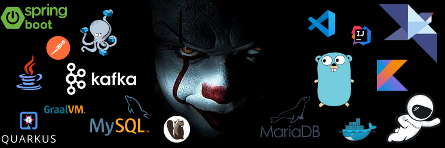

## ⚙️ Introduction.

This lab has the objective of testing different frameworks and tools, such as Helidon, Micronaut, and Quarkus, among others. 

## 🛠 Stack.

<ol>
  <li>Java</li>
  <li>Kotlin</li>
  <li>Golang</li>
  <li>Helidon</li>
  <li>Micronaut</li>
  <li>Quarkus</li>
  <li>Spring boot</li>
  <li>Docker</li>
  <li>Docker Compose</li>
  <li>Mysql</li>
  <li>MariaDB</li>
  <li>Dbeaver</li>
  <li>Kafka</li>
  <li>Postman</li>
  <li>Intellij</li>
  <li>VsCode</li>
</ol>

## ⚙️ General Architecture.

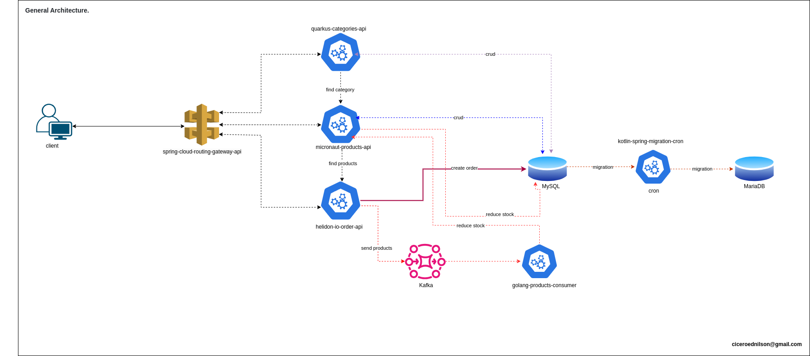

## ⚙️ Docker Compose.

Execute the "docker-compose" command in the [docker-compose](docker-compose) folder to create your containers.

~~~~shell
sudo docker-compose up -d --build
~~~~

## ⚙️ MySQL.

To create our database and tables, we use the commands below.

#### 🛠 [scripts](db-mysql-scripts-database)

Create Data Base.
~~~~sql
CREATE DATABASE db_system;
~~~~

Create table tb_category.
~~~~sql
CREATE TABLE IF NOT EXISTS tb_category (
    id_category BIGINT NOT NULL AUTO_INCREMENT PRIMARY KEY,
    ds_category VARCHAR(150) NOT NULL,
    dt_created DATETIME NOT NULL,
    fl_active BOOLEAN NOT NULL
);
~~~~

Create table tb_product.
~~~~sql
CREATE TABLE IF NOT EXISTS tb_product (
    id_product  BIGINT NOT NULL AUTO_INCREMENT PRIMARY KEY,
    ds_product  VARCHAR(150) NOT NULL,
    id_category BIGINT NOT NULL,
    vl_product  DECIMAL(10,2) NOT NULL,
    qt_product  INT NOT NULL,
    dt_created  DATETIME NOT NULL,
    dt_updated  DATETIME NOT NULL,
    fl_active   BOOLEAN NOT NULL,
    FOREIGN KEY (id_category) REFERENCES tb_category(id_category)
);
~~~~

Create table tb_order.
~~~~sql
CREATE TABLE IF NOT EXISTS tb_order (
	id_order    BIGINT NOT NULL PRIMARY KEY AUTO_INCREMENT,
	vl_total    DECIMAL(10,2) NOT NULL,
	dt_created  DATETIME NOT NULL,
	dt_updated  DATETIME NOT NULL,
	fl_active   BOOLEAN NOT NULL
);
~~~~

Create table tb_order_x_product.
~~~~sql
CREATE TABLE IF NOT EXISTS tb_order_x_product (
	id_order    BIGINT NOT NULL,
	id_product  BIGINT NOT NULL,
	dt_created  DATETIME NOT NULL,
	dt_updated  DATETIME NOT NULL,
    fl_migrated tinyint(1) NOT NULL DEFAULT '0',
	FOREIGN KEY (id_product) REFERENCES tb_product(id_product),
	FOREIGN KEY (id_order) REFERENCES tb_order(id_order),
	CONSTRAINT PK_id_order_x_id_product PRIMARY KEY (id_order, id_product)
);
~~~~

Below, we can see our database and tables that were created.

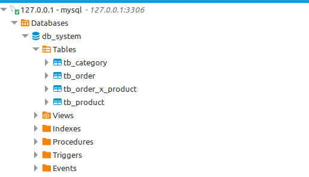

## ⚙️ MariaDB.

To create our database and tables, we use the commands below.

#### 🛠 [scripts](db-mariadb-scripts-database)

Create Data Base.
~~~~sql
CREATE DATABASE db_system_bi;
~~~~

Create table tb_order_bi.
~~~~sql
CREATE TABLE IF NOT EXISTS tb_order_bi (	
    id_order     BIGINT NOT NULL,
    id_product   BIGINT NOT NULL,
    ds_product   VARCHAR(150) NOT NULL,
    vl_product   DECIMAL(10,2) NOT NULL,
    id_category  BIGINT NOT NULL,
    ds_category  VARCHAR(150) NOT NULL,  
    dt_created   DATETIME NOT NULL,
    dt_migrated  DATETIME NOT NULL,	
	PRIMARY KEY (id_order, id_product)
);
~~~~

Below, we can see our database and tables that were created.

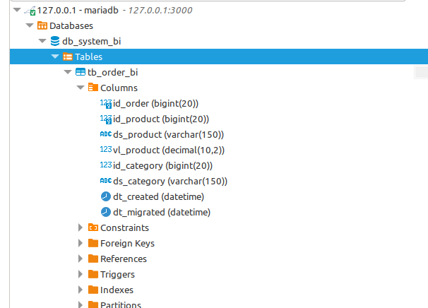

## ⚙️ Kafka.

To check if Kafka is running correctly, you can access the address [http://localhost:8080/](http://localhost:8080/).

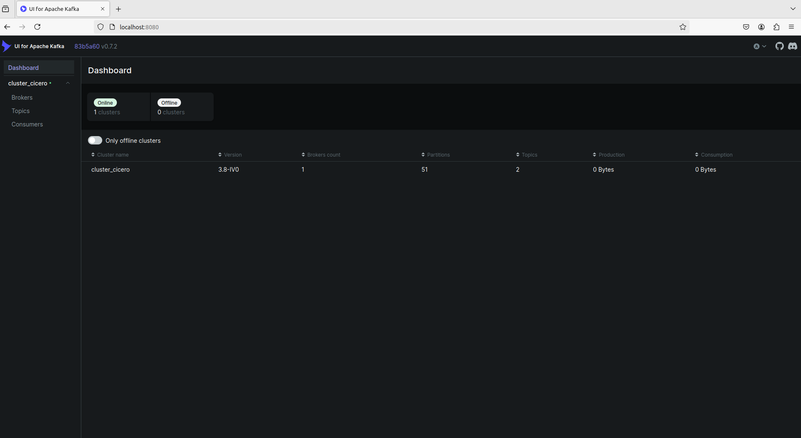

## ⚙️ Quarkus.

Below, you can check the source.

#### 🚀 [quarkus-categories-api](quarkus-categories-api)

## ⚙️ Quarkus - Architecture.

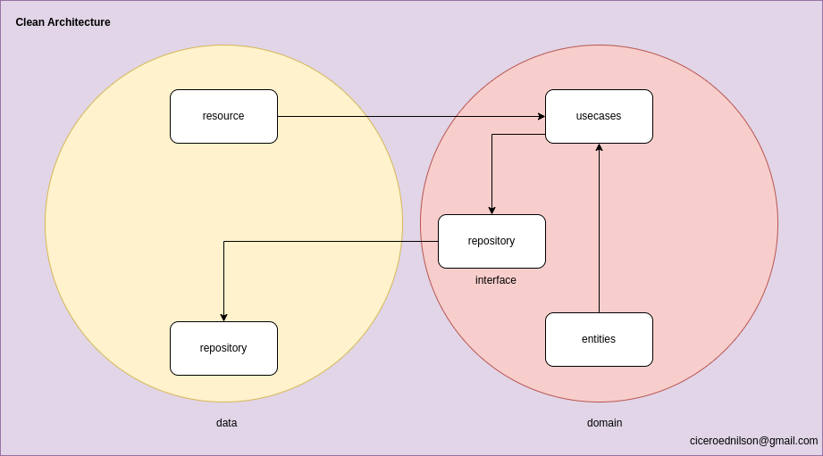

## ⚙️ Quarkus - Project structure.

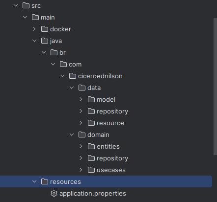

## ⚙️ Quarkus - cURL examples for testing.

#### 🚀 Collection: [quarkus-category.postman_collection.json](postman-collections/quarkus-category.postman_collection.json)

Find all categories.
~~~~shel
curl --location 'http://localhost:4000/category/all'
~~~~

Find the category by its ID
~~~~shel
curl --location 'http://localhost:4000/category/2' \
--data ''
~~~~

Create a new category.
~~~~shel
curl --location 'http://localhost:4000/category' \
--header 'Content-Type: application/json' \
--data '{
    "name": "Livros",
    "active": true
}'
~~~~

Update the category.
~~~~shel
curl --location --request PUT 'http://localhost:4000/category/4' \
--header 'Content-Type: application/json' \
--data '    {
        "active": true,        
        "name": "Roupas Masculinas"
    },'
~~~~

Delete the category.
~~~~shel
curl --location --request DELETE 'http://localhost:4000/category/1'
~~~~

## ⚙️ Micronaut.

Below, you can check the source.

#### 🚀 [micronaut-products-api](micronaut-products-api)

## ⚙️ Micronaut - Architecture.

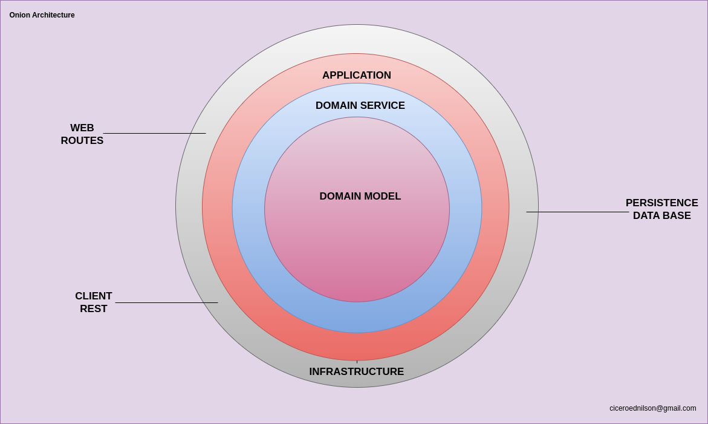

## ⚙️ Micronaut - Project structure.

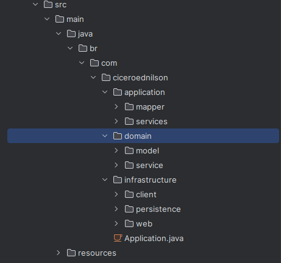

## ⚙️ Micronaut - cURL examples for testing.

#### 🚀 Collection: [micronaut-product.postman_collection.json](postman-collections/micronaut-product.postman_collection.json)

Find all products.
~~~~shel
curl --location 'http://localhost:9000/product/findAll'
~~~~

Find the product by its ID
~~~~shel
curl --location 'http://localhost:9000/product/4'
~~~~

Create a new product.
~~~~shel
curl --location 'http://localhost:9000/product' \
--header 'Content-Type: application/json' \
--data '{    
    "product": "Jogo do Mario Deluxe",
    "idCategory": 2,
    "price": 99.99,
    "total": 200,
    "created": "2024-08-27T15:00:00",
    "updated": "2024-08-27T15:30:00",
    "active": true
}'
~~~~

Update the product.
~~~~shel
curl --location --request PUT 'http://localhost:9000/product/4' \
--header 'Content-Type: application/json' \
--data '{    
    "product": "Jogo do Sonic 4",
    "idCategory": 2,
    "price": 99.99,
    "total": 200,
    "created": "2024-08-27T15:00:00",
    "updated": "2024-08-27T15:30:00",
    "active": false
}'
~~~~

Delete the product.
~~~~shel
curl --location --request DELETE 'http://localhost:9000/product/1'
~~~~

Reduce the inventory of the product.
~~~~shel
curl --location --request PUT 'http://localhost:9000/product/4/reduce/stock' \
--data ''
~~~~

## ⚙️ Helidon MP.

Below, you can check the source.

#### 🚀 [helidon-io-order-api](helidon-io-order-api)

## ⚙️ Helidon MP - Architecture.

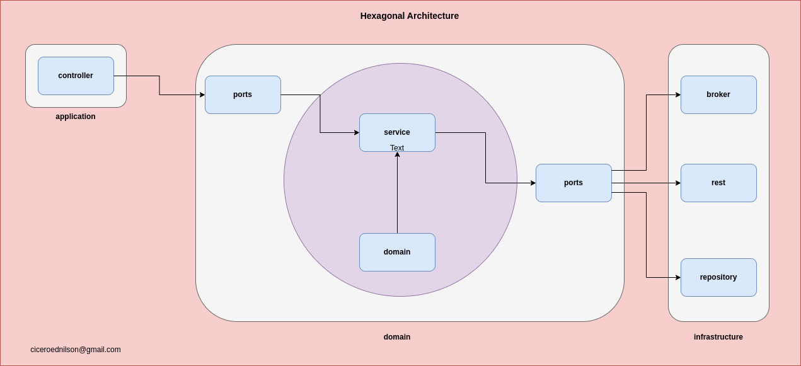

## ⚙️ Helidon MP - Project structure.

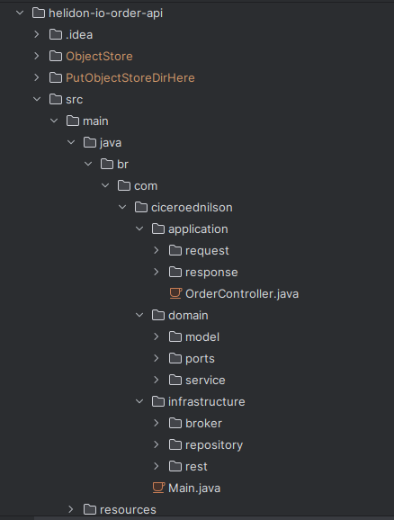

## ⚙️ Helidon MP - cURL example for testing.

#### 🚀 Collection: [helidon-io-order.postman_collection.json](helidon-io-order.postman_collection.json)

Create an order.
~~~~shel
curl --location 'http://localhost:9009/order' \
--header 'Content-Type: application/json' \
--data '{
  "products": [6,8]
}'
~~~~

## ⚙️ Golang.

Below, you can check the source.

#### 🚀 [golang-products-consumer](golang-products-consumer)

## ⚙️ Golang - Architecture.

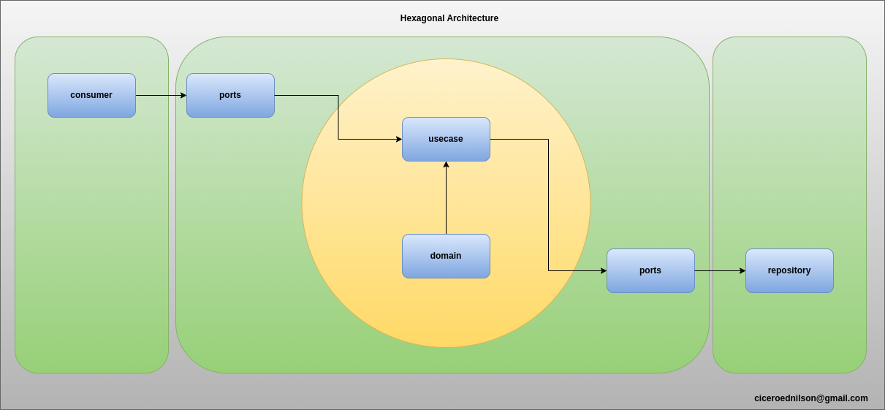

## ⚙️ Golang - Project structure.

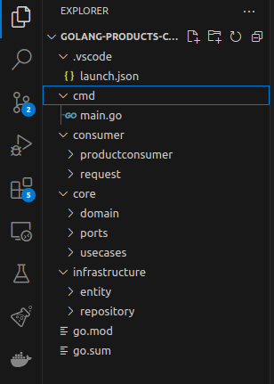

## ⚙️ Golang - Consumers receive this message from the Kafka broker.

After the broker receives a message, this service calls the [micronaut-products-api](micronaut-products-api) service to reduce the products from stock.

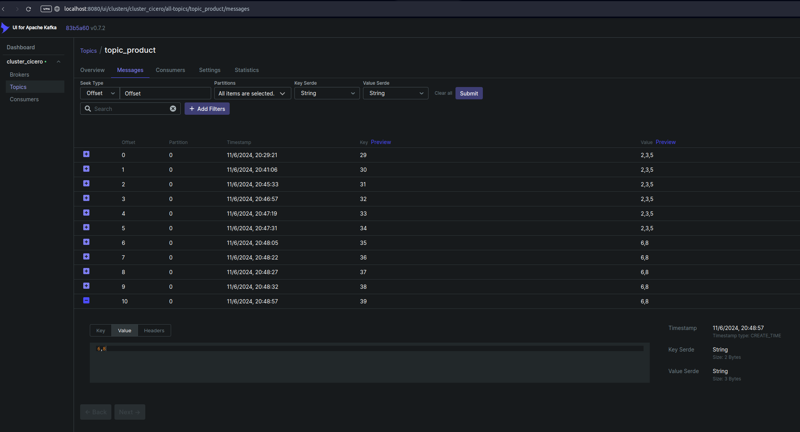

## ⚙️ Kotlin/Spring.

Below, you can check the source.

#### 🚀 [kotlin-spring-migration-cron](kotlin-spring-migration-cron)

## ⚙️ Kotlin/Spring - Architecture.

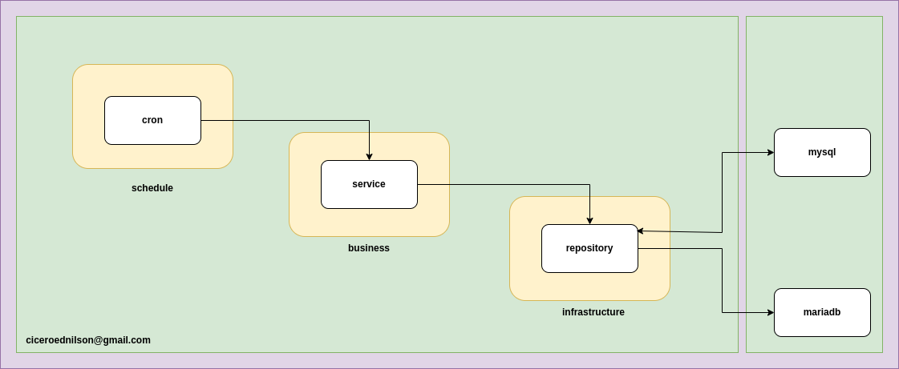

## ⚙️ Kotlin/Spring - Project structure.

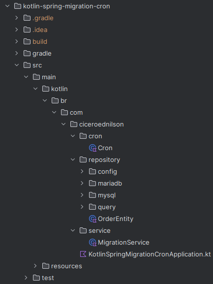

## ⚙️ Kotlin/Spring - Migration Data.

After the data migration, we check it in MariaDB, as shown below.

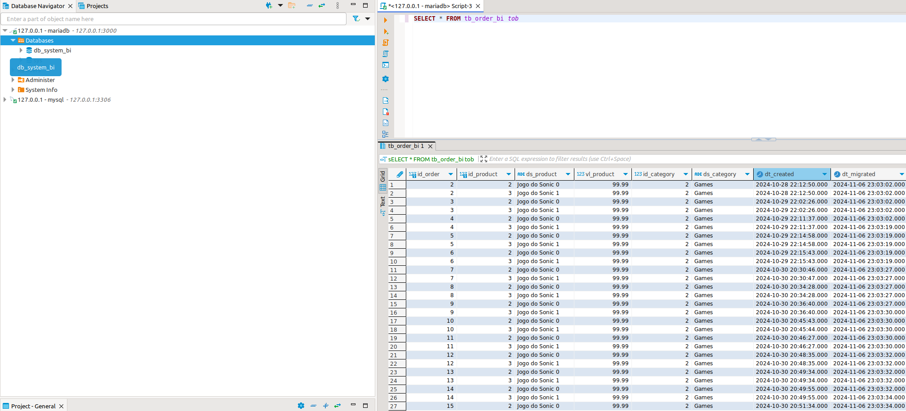

## ⚙️ Spring Gateway.

Below, you can check the source.

#### 🚀 [spring-cloud-routing-gateway-api](spring-cloud-routing-gateway-api)

## ⚙️ Spring Gateway - Project structure.

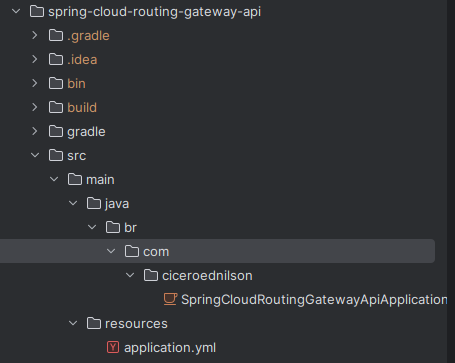

## ⚙️ Spring Gateway - Routes.

Below is the configuration of the routes between the gateway and other services.

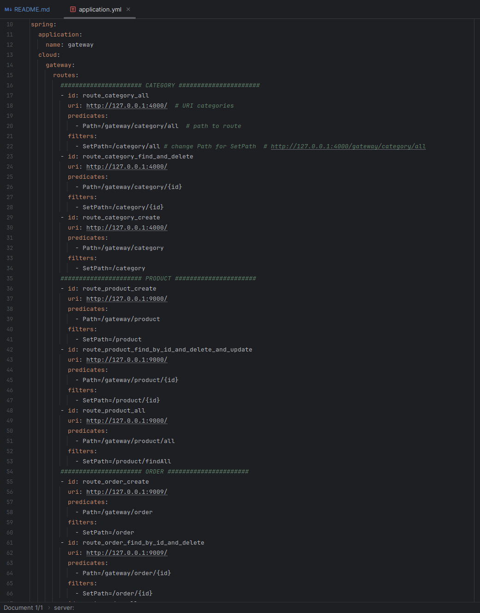

## ⚙️ Spring Gateway - cURL examples for testing.

#### 🚀 Collection: [spring-cloud-routing-gateway-api.postman_collection.json](postman-collections/spring-cloud-routing-gateway-api.postman_collection.json)

Find all categories.
~~~~shel
curl --location 'http://127.0.0.1:6000/gateway/category/all'
~~~~

Find the category by id.
~~~~shel
curl --location 'http://127.0.0.1:6000/gateway/category/3'
~~~~

Create the new category.
~~~~shel
curl --location 'http://127.0.0.1:6000/gateway/category' \
--header 'Content-Type: application/json' \
--data '{
    "name": "Ebook 2",
    "active": true
}'
~~~~

Delete a category.
~~~~shel
curl --location --request DELETE 'http://127.0.0.1:6000/gateway/category/8' \
--data ''
~~~~

Create the new product.
~~~~shel
curl --location 'http://localhost:6000/gateway/product' \
--header 'Content-Type: application/json' \
--data '{    
    "product": "Ouro Branco",
    "idCategory": 5,
    "price": 99.99,
    "total": 200,
    "created": "2024-08-27T15:00:00",
    "updated": "2024-08-27T15:30:00",
    "active": true
}'
~~~~

Update the product.
~~~~shel
curl --location --request PUT 'http://localhost:6000/gateway/product/4' \
--header 'Content-Type: application/json' \
--data '{    
    "product": "Jogo do Sonic 4",
    "idCategory": 2,
    "price": 99.99,
    "total": 200,
    "created": "2024-08-27T15:00:00",
    "updated": "2024-08-27T15:30:00",
    "active": false
}'
~~~~

Find all products.
~~~~shel
curl --location 'http://localhost:6000/gateway/product/findAll'
~~~~

Delete a product.
~~~~shel
curl --location --request DELETE 'http://localhost:6000/gateway/product/7'
~~~~

Create the new order.
~~~~shel
curl --location 'http://localhost:6000/gateway/order' \
--header 'Content-Type: application/json' \
--data '{
  "products": [2,3]
}'
~~~~

## 📌 Version.

1.0

## ✒️ Author.

Cícero Ednilson - ciceroednilson@gmail.com